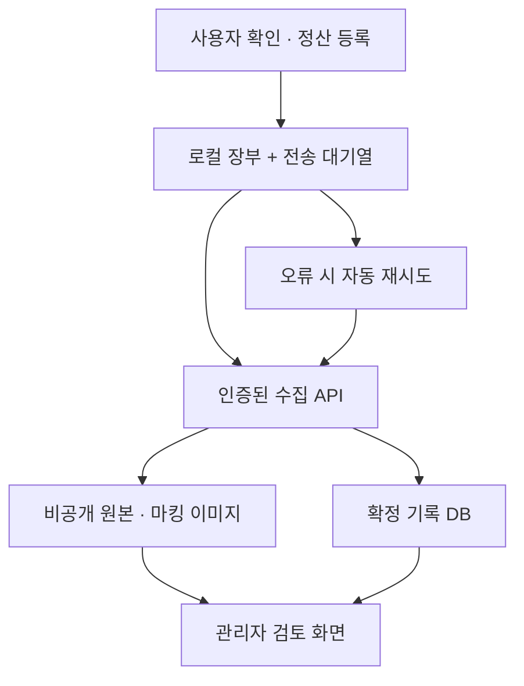

> 구현 상태는 [COLLECTION_SETUP.md](COLLECTION_SETUP.md)를 기준으로 확인하세요. 아래는 전체 확장 설계로, 보관 기간 자동 처리/정정 revision 등 후속 항목도 포함합니다.

# 보스 보상 자동 수집 설계

상태: 설계 확정안 / 중앙 서버·관리자 화면은 아직 구현 또는 연결하지 않았음.
대상: `ryemso/cat_hero_boss_reward`의 GitHub Pages 웹형. 설치형은 같은 API를 사용하는 후속 확장.

## 1. 확정 동작

사용자가 **정산 등록**을 누르면 개인 장부에 저장하고, 확정된 보상 기록과 **원본 이미지 + 카드 영역을 마킹한 이미지**를 관리자 서버에 자동 전송한다. 별도 제출 버튼을 만들지 않는다. 업로드 직후에는 전송하지 않고, 사용자가 보상/수량을 확인한 등록 시점의 결과를 전송한다.

등록 화면의 고정 안내 문구:

> 정산 등록 시 보스명, 처치 시각, 참여 인원, 보상 종류·수량, 인식 결과와 원본·마킹 이미지가 운영자에게 자동 전송됩니다. 참여자 이름과 개인 메모는 전송하지 않습니다.

서비스의 수집 목적은 보상 분포 분석과 이미지 인식 개선이다. 분석 대상 기록은 유저 확인 기록이며 게임 서버가 검증한 기록은 아니다.

이미지 없이 직접 입력한 기록도 등록·전송할 수 있지만 `evidence_status=manual_only`로 구분하고 이미지 기반 분석의 기본 모집단에서는 제외한다. 이미지를 선택했는데 파일을 보관하지 못했거나 마킹 생성에 실패한 경우, 이미지 포함 등록 완료로 처리하지 않는다. 실패 원인을 표시하고 다시 등록하도록 한다.

## 2. 구성

- GitHub Pages: 기존 웹 화면, 브라우저 OCR, 마킹 생성, 로컬 장부/전송 대기열.
- Supabase Auth: 일반 유저의 이메일 로그인, 관리자의 별도 로그인. 첫 버전에서는 익명 로그인 대신 이메일 로그인으로 고정한다. 수집 DB에는 Auth UUID만 기록하며 이메일을 복사하지 않는다.
- Supabase Postgres: 제출 기록, 보상 행, 이미지 메타데이터, 검토 상태, 관리자 권한.
- Supabase Storage: 공개되지 않는 `raid-evidence` 버킷.
- Supabase Edge Functions: 등록 시작, 업로드 완료 확인, 기록 확정, 관리자 조회/이미지 접근, 정정/삭제 요청.

Supabase 프로젝트·관리자 계정은 실제 구현/연결 단계에서 준비한다. 계정 가입을 임의로 실행하거나 키를 생성한 상태가 아니다. 프런트엔드에는 프로젝트 URL과 공개용 키만 들어가고, 서버용 비밀 키는 Edge Function 환경에만 둔다.

## 3. 등록과 전송 순서

1. 이미지 선택 시 원본 File/Blob과 해시, 인식에 사용한 기준 캔버스의 크기를 유지한다.
2. 카드 검출 결과의 좌표, OCR 원본값, 최초 추천 보상, 후보ID, 점수는 수정 전에 별도 보관한다.
3. 등록 클릭 시 활성 참여자/보상·수량을 검증한다. 소환권 수량 등은 사용자 확인값으로 확정한다.
4. 전역 UUID `client_record_id`를 생성한다. 현재 로컬 숫자 Raid ID를 서버 키로 사용하지 않는다.
5. 확정 행과 인식 원본을 비교해 보상 수정/수량 수정 여부를 계산하고 마킹 이미지를 생성한다.
6. 로컬 장부 행, 전송 payload, 원본 Blob, 마킹 Blob을 **한 IndexedDB 트랜잭션**으로 보관한다. 이 시점에 `개인 장부 저장 완료 · 관리자 전송 대기`를 표시한다.
7. 인증된 `begin-submission`을 호출해 서버 수집 ID와 원본/마킹의 제한된 업로드 URL을 받는다.
8. 두 이미지 업로드 후 `finalize-submission`을 호출한다. 서버가 파일 존재·종류·크기·해시와 payload를 확인한 뒤 기록/보상 행/이미지 메타데이터를 DB 트랜잭션으로 확정한다.
9. 확정 응답을 받아야 `관리자 전송 완료`로 표시한다. 응답 유실 시 같은 UUID로 조회/재시도한다.
10. 관리자 화면에는 확정된 제출만 기본 목록에 표시한다. 중간 업로드는 운영 진단 목록에만 표시한다.

DB와 파일 저장소는 하나의 트랜잭션으로 묶이지 않는다. `uploading → complete` 단계를 분리해 부분 업로드가 분석 데이터로 들어가지 않게 한다. 미완료 파일은 24시간 뒤 정리하고, 재시도 시 새 업로드 URL을 발급한다.

## 4. 이미지 마킹

**원본**은 받은 파일의 바이트를 그대로 저장한다. 원본 위에 직접 그림을 그려 덮어쓰지 않는다.

**마킹 이미지**는 OCR 기준 캔버스의 복사본에 다음을 그려 PNG로 저장한다.

| 항목 | 표시 |
|---|---|
| 카드 영역 | 테두리 + `#1`, `#2` 번호 |
| 확정값 | 확정 보상명 × 확정 수량 |
| 추천값 | 후보ID + 최초 추천 보상 + 아이콘 유사도 |
| 수량 | OCR 원본 수량 + 수량 신뢰도, OCR 미사용이면 `기본 1개` |
| 수정 | 보상 변경 / 수량 변경 배지 |
| 상태 | 자동매칭 / 낮은 점수 / OCR 실패 / 수동 입력 |

색상은 정상 확인 초록, 사용자 수정 주황, 인식 확인 필요 빨강으로 지정하며 텍스트도 함께 표시한다. 숫자 신뢰도를 정답 확률로 설명하지 않는다. 레이블은 이미지 가장자리를 벗어나지 않게 배치하고 카드가 작으면 오른쪽 범례 패널에 상세 정보를 둔다. 범례 패널을 추가하더라도 원본 좌표를 바꾸지 않는다.

좌표는 브라우저가 방향 보정을 적용해 OCR에 사용한 캔버스 기준이다. `coordinate_space=normalized_canvas`, 기준 폭/높이와 정수 bbox를 함께 전송한다. 원본 파일의 방향 메타데이터가 있으면 관리자 뷰어도 같은 방향으로 정규화해 오버레이한다. 모든 bbox가 기준 이미지 범위 안인지 서버에서 검증한다.

직접 추가한 보상에는 bbox가 없다. `수동 추가` 항목으로 범례에 표시한다. 검출 행을 삭제한 경우 `excluded=true` 인식 결과를 유지해 삭제된 카드도 회색 점선으로 표시하되 지급 보상 합계에서는 제외한다.

브라우저가 만든 마킹 이미지 자체는 진위 증거가 아니다. 관리자 화면은 저장된 원본과 검증된 구조화 좌표/확정값으로 오버레이를 다시 그릴 수 있어야 한다. 이 서비스는 게임 서버와 연동하지 않으므로 조작된 스크린샷까지 확실히 판별할 수는 없다.

## 5. 전송 데이터

필수 처치 데이터: UUID, 처치 날짜/시간과 timezone, 안정적인 보스 key, 실제 참여 인원, 확정 보상 배열, 앱/템플릿 버전, 이미지 유무, 안내 문구 버전.

서버가 결정하는 데이터: 로그인 사용자ID, 서버 수신 시각, 서버 수집 ID, 처리/검토 상태, 이미지 경로·검증 해시, 중복 그룹.

전송하지 않는 데이터: 참여자 이름/로컬 member ID, 개인 메모, 원본 파일명, 유저별 정산 단가/현금/수수료 설정. 원본 이미지 내부에 게임 닉네임 등이 보일 수 있다는 점은 안내한다.

보상 식별자는 로컬 reward ID나 사용자가 바꿀 수 있는 보상명 대신 서버의 안정적인 key를 사용한다. 기본 key는 `blue_item`, `green_item`, `white_item`, `legend_pickup`, `companion_summon`, `rune_summon`, `random_rune`, `purple_recipe`, `blue_recipe`, `green_recipe`, `red_recipe_excluded`, `purple_item_excluded`다. 기존 CSV/U01~U33 그룹에서 생성하며 개인 단가를 중앙 분석의 기본값으로 사용하지 않는다.

후보ID는 **OCR 최초 추천 후보**다. 사용자가 다른 보상으로 수정해도 후보ID를 새 보상의 후보로 바꾸지 않는다. 최초 추천과 확정 key를 함께 보관한다. 단가나 이름 변경 때문에 기존 정산 컬럼/U 매핑을 바꾸지 않는다.

수량은 0 이상의 유한한 숫자, 참여 인원은 양의 정수로 검증한다. 비정상적으로 큰 수량은 삭제하거나 조용히 보정하지 않고 검토 대상으로 분류한다. 수동 추가 항목의 OCR/점수/좌표 필드는 null이다. 데이터 예시는 `auto_collection.example.json` 참조. 예시의 UUID·좌표·파일 크기·해시는 설명용 값이며 실제 제출 데이터가 아니다.

## 6. 서버 데이터 구조

| 테이블 | 주요 필드 / 규칙 |
|---|---|
| `submissions` | id UUID, owner_id, client_record_id, raid_date/time/timezone, boss_key, participant_count, status, review_status, evidence_status, app_version, template_version, notice_version, received_at, revision |
| `submission_rewards` | submission_id, row_id UUID, reward_key, display_name_snapshot, confirmed_quantity, detected_reward_key, ocr_quantity, candidate_id, match_score, quantity_confidence, rarity, bbox, correction_flags, quantity_mode |
| `recognition_observations` | submission_id, detection_id, bbox, 모든 최초 인식값, included/excluded, 확정 행 연결. 삭제한 검출 카드도 유지 |
| `submission_images` | submission_id, kind original/marked, storage_path, sha256, mime, byte_size, width, height, coordinate_space, mark_version |
| `duplicate_groups` | 원본 SHA-256/유사 이미지 후보 그룹, 대표 submission_id, 관리자 판정 |
| `admin_members` | Auth user_id, 조회/검토/관리 권한. 일반 유저 수정 불가 |
| `review_events` | submission_id, 관리자ID, 처리 내용, 이유, 시각. 판정 이력 |

`submissions`는 `(owner_id, client_record_id)`로 유일하다. 이미지는 `(submission_id, kind)`로 유일하다. 서버의 수정 이력은 유저 입력과 분리한다.

**권한:** 일반 유저는 자신의 전송 상태만 조회한다. 일반 유저끼리 다른 제출이나 이미지를 열람할 수 없다. 이미지는 관리자만 읽는 정책으로 고정한다. 일반 유저의 이미지 검토는 서버에서 다시 내려받지 않고 로컬 사본을 사용한다. 파일 업로드는 본인 소유의 미완료 제출에만 허용한다. 관리자 역할은 서버의 권한 테이블로 검증하며 프런트엔드 플래그나 사용자가 수정할 수 있는 프로필 필드를 신뢰하지 않는다.

공개 Data API 테이블은 RLS를 켜고, 클라이언트 직접 insert/update는 막아 인증/검증된 Edge Function 경로만 사용한다. 서버용 키가 RLS를 우회하므로 Edge Function은 매 요청의 JWT와 소유권/관리자 역할을 별도로 확인해야 한다. 이미지 다운로드는 관리자 검증 후 짧은 만료시간의 signed URL을 발급한다. signed URL은 소지자가 만료 전 접근 가능한 bearer URL이므로 다른 사람에게 공유하지 않도록 한다.

## 7. API 계약

| API | 입력 | 결과 / 규칙 |
|---|---|---|
| `begin-submission` | UUID, schema version, 데이터 해시, 이미지 manifest, 기록 payload | 서버 ID + 원본/마킹 업로드 URL. owner는 JWT에서 결정 |
| `finalize-submission` | 서버 ID + payload 해시 | 이미지 검증 후 complete. 이미 complete이면 같은 결과 반환 |
| `submission-status` | UUID | 본인 전송 상태. 재시도 전 확인 |
| `revise-submission` | 서버 ID, expected_revision, 수정 payload/새 마킹 이미지 manifest | 서버 보상/검토 이력 revision 증가. 원본은 보존 |
| `withdraw-submission` | 서버 ID | 본인 요청 기록을 분석에서 제외하고 정리 대상 처리 |
| `admin-list` | 필터, cursor, page size | 관리자만 전체 기록 페이지 조회 |
| `admin-evidence` | 서버 ID | 관리자만 원본/마킹의 만료 URL 발급 |
| `admin-review` | 서버 ID, 판정, 이유 | 검증/중복/제외/기각 판정과 감사 로그 |
| `admin-export` | 기간/보스/검토 상태/이미지 유무 | 관리자만 CSV. 기본은 중복·기각 제외 |

같은 UUID·같은 데이터 해시 재요청은 같은 결과다. 같은 UUID·다른 해시는 `409 CONFLICT`이며 정정 API를 사용한다. 원본/마킹 해시와 데이터 해시를 각각 보관한다. 이미지의 실제 해시는 서버에서 계산하여 클라이언트 주장과 대조한다. 해시 확인은 위변조 의도가 없다는 보장이 아니라 전송 무결성 확인이다.

입력 파일은 기존 UI와 동일한 PNG/JPEG, 파일당 20MB 이하로 제한한다. 서버는 MIME 주장만 보지 않고 이미지 디코딩과 픽셀 수 상한도 검증한다. 마킹은 PNG다. 인증 실패는 재로그인, 권한 오류는 중단, 제한/네트워크/5xx는 재시도, payload 오류는 사용자 수정 필요로 분리한다. 서버는 계정별 전송량과 요청 속도를 제한한다. CORS는 운영 Pages origin을 허용하지만 인증 수단으로 취급하지 않는다.

## 8. 로컬 대기열과 실패 처리

상태: `queued → uploading → finalizing → synced`. 네트워크/일시 오류는 `retry_wait`, 로그인 만료는 `auth_required`, 파일 손실/검증 오류는 `needs_attention`이다.

- IndexedDB에 원본/마킹 Blob과 payload를 보관한다. 이미지를 localStorage에 base64로 넣지 않는다.
- 현재 localStorage 장부는 IndexedDB로 일회 마이그레이션하고, 기존 JSON 백업 형식은 호환 유지한다. 기존 과거 기록은 원본 이미지가 없으므로 일괄 자동 전송하지 않는다.
- 앱 시작, 네트워크 복구, 등록 완료 직후 대기열을 처리한다. 일정 지연 + 지터로 재시도하고 무한한 즉시 반복을 피한다.
- 탭 여러 개가 열려도 동일 UUID로 서버 저장이 중복되지 않는다. 탭 간 queue lock을 추가하되 최종 중복 방지는 서버 unique constraint가 맡는다.
- 브라우저를 닫은 동안 전송을 보장하지 않는다. 다음 접속 시 재개한다. `전송 대기 N건`을 장부/설정에 표시한다.
- 저장 공간 부족으로 로컬 트랜잭션이 실패하면 정산 등록 성공을 표시하지 않는다. 서버 전송 실패만으로 개인 장부 행을 되돌리지는 않는다.
- JSON 백업은 장부를 보존하지만 이미지 대기열 전체를 보존하지는 않는다. 대기열이 남아 있을 때 브라우저 데이터 삭제/기기 이동 전 경고하고, 필요 시 별도 이미지 포함 ZIP 백업을 제공한다.
- synced 이후 대기열 Blob은 제거하되 로컬 장부 행의 UUID/서버 상태는 남긴다.

## 9. 수정/삭제 정책

현재 앱에는 보스전 삭제가 있다. 자동 수집 버전에서는 로컬 삭제 시 전송 상태를 함께 처리한다. 미전송 queue는 취소하고, 이미 전송됐으면 자동 withdrawal 요청을 보관한다. 서버가 철회 처리할 때까지 `삭제 요청 대기`로 표시한다. 등록 중 삭제되는 race도 같은 UUID의 취소 상태를 서버가 확인해 complete로 분석에 들어가지 않게 한다.

확정된 보상 수정 기능을 이후 추가하면 같은 제출 UUID에 정정 revision을 적용하며 새 마킹을 생성한다. 원본은 동일한 파일을 재업로드하지 않는다. 보상 마스터 단가·이름 변경은 과거 중앙 수집 기록을 다시 쓰지 않는다.

## 10. 중복과 분석

재시도/더블클릭 중복은 UUID로 차단한다. **여러 유저가 같은 보스전 스크린샷을 제출한 경우** 각 유저의 전송 상태는 성공 처리하고 관리자 목록에서 중복 후보로 묶는다. 해시만으로 같은 처치라고 단정하지 않는다. 압축/크롭이 다르면 동일 장면도 다른 해시가 될 수 있고, 겉보기 같은 이미지가 별도 처치일 수 있다. 유사 해시·보스·시간·보상 조합은 후보 탐지용으로 사용하고 관리자가 대표 기록을 정한다.

관리자 집계는 등록 횟수와 중복 제거한 처치 횟수를 구분한다. 기본 분석은 확정/검토 통과 + 이미지 있음 + 대표 기록만 사용하고, 수동 입력·미검토 포함 여부를 필터로 조정한다. 제외 상태의 빨레/보는 개인 정산 가치에서는 제외하되 보상 분포 연구에서는 원본 종류/수량으로 보관한다.

특정 보상 확률을 계산하려면 정상적으로 전체 보상 목록이 포함된 처치만 분모에 포함한다. 카드 행 삭제/일부 화면 크롭/검출 누락 여부를 함께 검토한다. 자발적으로 등록된 데이터는 모든 게임 플레이를 대표하지 않으므로 결과는 `수집된 처치 기록의 보상 분포`로 표현한다.

## 11. 관리자 화면

별도 관리자 탭/경로. 로그인 뒤 서버가 관리자 권한을 확인한다.

- 목록: 보스, 처치/수신 시각, 참여 인원, 보상 개수, 수정 유무, 이미지 유무, 중복 여부, 검토 상태.
- 필터: 기간, 보스, 사용자ID, 인식점수, 수정 여부, 이미지 유무, 검토 상태.
- 상세: 원본 / 마킹 / 재생성 오버레이와 보상표를 나란히 확인. OCR 원본→사용자 확정→관리자 판정을 구분.
- 조치: 검토 통과, 중복 그룹 지정, 분석 제외, 기각, 철회 확인.
- 내보내기: CSV, 현재 적용한 필터와 분모/제외 기준 명시. 파일에는 만료 이미지 URL을 넣지 않고 서버 ID를 넣는다.

기본 원본/마킹 보관 기간은 90일, 명시적 OCR 개선 검토 대상으로 지정한 이미지에는 별도 보존 정책을 적용한다. 이미지 제거 후에도 삭제 시각과 증빙 없음 상태를 표시한다. 유지 가능한 익명화 통계와 개인별 원본 기록의 보관은 분리한다. 이는 제품 설계 기본값이며 법적 적합성 판단이나 확정된 운영 정책이 아니다.

## 12. 실제 코드 연결 지점

| 현재 파일 | 후속 구현 |
|---|---|
| `web/src/vision.js` `recognize()` | 현재 반환에서 사라지는 card.box를 유지하고 detection_id, 최초 추천값을 추가 |
| `web/src/main.js` 이미지 change handler | 현재 지역변수인 File/캔버스를 증빙 저장소에 유지 |
| `web/src/main.js` `save-raid` | 현재 localStorage 저장을 IndexedDB 장부+outbox 트랜잭션으로 교체하고 자동 전송 예약 |
| `web/src/main.js` 삭제 처리 | 미전송 취소 / 서버 withdrawal queue 연결 |
| `web/src/domain.js` | canonical 보상 key, UUID, 동기화 상태의 검증과 구 JSON 백업 호환 |
| 신규 `web/src/annotation.js` | 원본을 덮어쓰지 않는 마킹/오버레이 생성 |
| 신규 `web/src/outbox.js` | Blob 보관, 트랜잭션, 재시도, 계정별 대기열 |
| 신규 `web/src/cloud.js` | Auth/수집 API. 서버 비밀 키 없음 |
| 신규 관리자 화면 | 서버 권한 기반 목록/증빙/검토/CSV |
| `core/db.py`, `app.py` | 설치형은 후속 단계에서 같은 UUID/API/대기열 계약으로 확장 |

## 13. 구현 순서 / 완료 판정

1. Supabase 프로젝트, 관리자 Auth UUID, 운영 공개 URL/키, 서버 비밀 키, 로그인 redirect URL 준비.
2. DB migration/RLS/비공개 버킷, 서버 API와 역할 검증 구현.
3. 웹형 로그인, 안내 문구, 인식 원본/bbox 유지, 마킹, IndexedDB 장부/queue 구현.
4. 자동 전송/재시도/정정·철회 구현.
5. 관리자 목록·원본/마킹 비교·중복 검토·CSV 구현.
6. 테스트와 배포 후 실제 계정/이미지로 운영 검증. 설치형 수집은 다음 단계.

필수 검증: 원본 불변, 수정 후 마킹 일치, deleted detection 표시, DEFAULT_ONE 신뢰도 null, 수동 기록 분리, 네트워크 실패 후 재접속 복구, 이미지 둘 중 하나만 업로드된 경우 분석 제외, 더블클릭/응답 유실 중복 없음, 잘못된 bbox/해시/보상 key 차단, 타 유저/비로그인/일반 유저의 관리자·이미지 접근 차단, 로컬 삭제 후 서버 철회, 기존 장부/U 매핑/루이 보스 유지.

## 공식 근거

- Supabase RLS: https://supabase.com/docs/guides/database/postgres/row-level-security
- 서버 비밀 키 분리: https://supabase.com/docs/guides/database/secure-data
- 비공개 버킷 및 signed URL: https://supabase.com/docs/guides/storage/buckets/fundamentals
- Storage 접근 제어: https://supabase.com/docs/guides/storage/security/access-control
